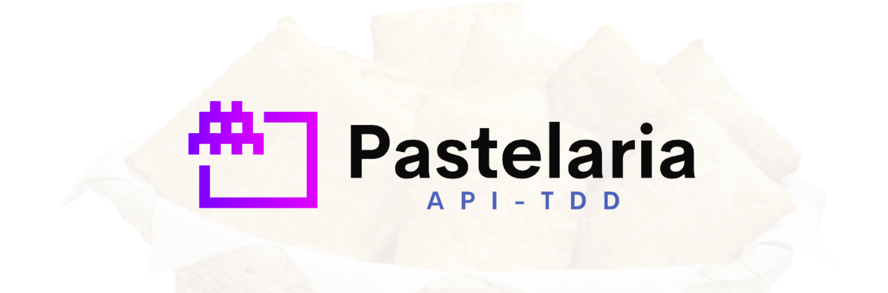

    

# Pastelaria - API TDD

## O que foi usado

## About Laravel

## License

Projeto sendo disponibilizado sobre a licença [MIT license](https://opensource.org/licenses/MIT).

A framework do Laravel é programa open-sourced licenciado sobre a [MIT license](https://opensource.org/licenses/MIT).
